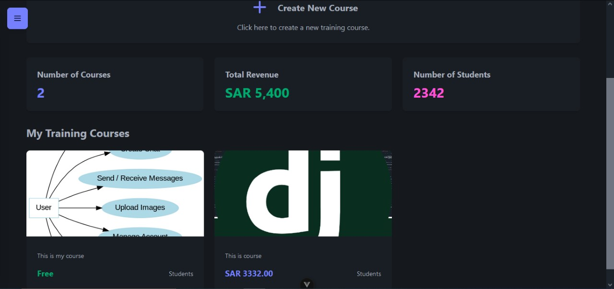

# Learning Management System (LMS) API with Vue.js

Welcome to the Learning Management System (LMS) API! This project is a robust, scalable backend solution built with Django and Django Rest Framework (DRF), coupled with a modern and responsive frontend using Vue.js. It is designed to manage courses and their associated modules, providing a structured and secure platform for educational content delivery.

## Features

- **Course Management**: Create, update, retrieve, and delete courses. Each course is tied to an instructor for proper ownership.
- **Module Management**: Organize course content into modules with customizable ordering. Only the course instructor can modify modules.
- **Authentication & Permissions**: Secure access using Token Authentication and IsAuthenticated permissions.
- **RESTful API Design**: Follows REST principles with hyperlinked relationships for intuitive navigation.
- **Custom Query Logic**: Retrieve modules filtered by course ID for efficient data access.
- **Interactive Frontend**: A Vue.js-powered frontend for seamless interaction with the backend API, including real-time updates and dynamic views.

## Technologies Used

### Backend
- **Framework**: Django, Django Rest Framework (DRF)
- **Authentication**: dj-rest-auth & django-alluth
- **Database**: PostgreSQL
- **API Documentation**: Auto-generated using drf-spectacular browsable API.
- **Project Scaffold**: Cookiecutter Django

### Frontend
- **Framework**: Vue.js 3
- **Routing**: Vue Router
- **UI Framework**: Tailwind CSS, DaisyUI

### Integration

1. **API Consumption**: Use Axios or Fetch API in Vue.js to interact with the backend API endpoints.
2. **Authentication**: Implement login and token storage using Vuex/Pinia or localStorage.
3. **Components**: Create reusable Vue components for courses, modules, authentication, and navigation.
4. **Routing**: Use Vue Router to manage navigation between pages like course lists, module details, and user authentication.

## API Endpoints
This project includes a fully interactive API documentation powered by drf-spectacular, a library for generating Swagger and ReDoc documentation for Django REST Framework (DRF).

### Features

- **Interactive Swagger UI**: Test API endpoints directly within the browser.
- **MkDocs Material Interface**: A clean and customizable documentation tool with a modern Material Design theme.
- **Auto-generated**: No need to write documentation manually; drf-spectacularyasg extracts the information from DRF views and serializers.

## Contributing

Contributions are welcome! If you’d like to contribute, please follow these steps:

1. Fork the repository.
2. Create a new branch for your feature or bugfix.
3. Commit your changes with clear and descriptive messages.
4. Push your branch and submit a pull request.

## License

This project is licensed under the MIT License. See the LICENSE file for details.

---

By combining the power of Django and Vue.js, this LMS API provides a full-stack solution for managing and delivering educational content effectively. Happy coding!

